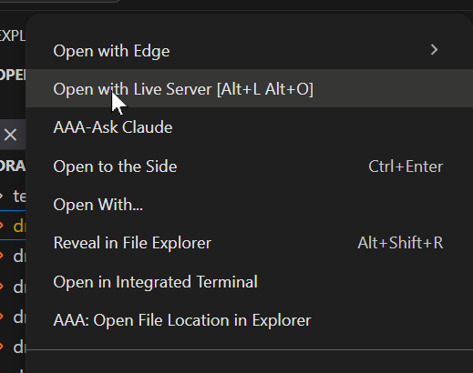
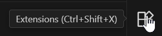
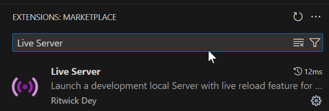

Kisitu;

  Hello here are some free examples for you.  They should show enough so you can decide which color combination you would like. 

  To see these files best, put them into a folder in your downloads folder e.g. DrAlex, then open visual studio code to that folder.  From there right click on the .html file and select  If you don't have that option then you'll need to install the Live Server Plugin, go to the 

   
  
  And search for Live Server.

  

  And click install. Reboot VSCode and it should work. 
  Just right click on any html file and pick "Open with live Server"
  
# Example Color Schemes
  
  
  
  
  
  
  

  Just updated YAML for pages publication on push
  